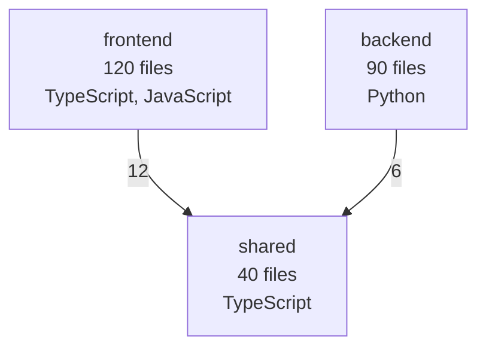

# GitHub High-Level Component Diagram Tool

This tool clones a GitHub repository and generates a **Mermaid high-level component diagram** based on:

- top-level code organization (components)
- dominant languages per component
- inferred dependencies between components from import statements

## Requirements

- Python 3.9+
- `git` installed and available in PATH

## Usage

```bash
python3 component_diagram_tool.py https://github.com/owner/repo
```

By default this creates:

- `component-diagram.mmd`

### Optional arguments

```bash
python3 component_diagram_tool.py https://github.com/owner/repo \
  --output my-diagram.mmd \
  --max-files 5000 \
  --keep-clone
```

## Diagram output format

The output is Mermaid `flowchart TD` format, for example:



You can render this diagram in:

- GitHub Markdown (Mermaid-supported views)
- Mermaid Live Editor: [https://mermaid.live](https://mermaid.live)
- docs tooling that supports Mermaid

## Notes

- This is a heuristic analyzer (high-level by design), not a full static compiler pipeline.
- It filters common build/vendor folders (`node_modules`, `dist`, `build`, etc.).
- It handles popular languages (Python, JS/TS, Java, Go, Rust, and more by extension grouping).

## Student Component Builder (English to Diagram)

You can also run an interactive student tool where:

- left side: write class/component details in plain English
- right side: live component/class diagram preview

Run:

```bash
python3 student_component_builder.py
```

Then open:

- [http://127.0.0.1:8000](http://127.0.0.1:8000)
